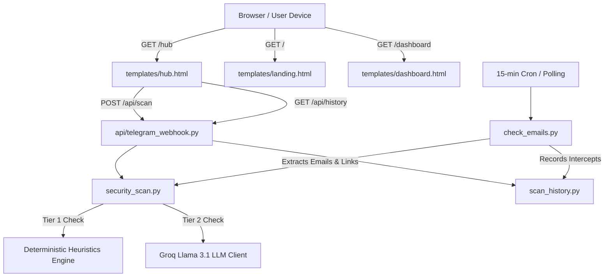

# ShieldSense — Structural Codebase Map & Call Graph

This document details the functional relationships, component interfaces, and call hierarchy across the ShieldSense codebase.

---

## Component Details

### 1. `api/telegram_webhook.py` (FastAPI Server)
- **Role:** Main application gateway.
- **Key Functions / Routes:**
  - `GET /` — Serves landing page.
  - `GET /hub` — Serves main MVP workspace.
  - `GET /dashboard` — Serves threat analytics dashboard.
  - `POST /api/scan` — Receives `{ text, subject, sender }`, routes to `security_scan.py:scan_content`, updates history, and returns JSON verdict.
  - `GET /api/history` — Returns JSON list of recent scan records.
  - `POST /webhook` — Telegram bot webhook receiving chat messages and dispatching `/scan`, `/check`, `/help`.

### 2. `security_scan.py` (Two-Tier Hybrid Detection Engine)
- **Role:** Evaluates whether content is Safe, Suspicious, or Dangerous.
- **Key Functions:**
  - `heuristic_scan(text, url)`: Tier-1 deterministic evaluation (checks keywords, typosquatting, entropy, suspicious extensions like `.apk`, `.exe`, `.scr`).
  - `call_groq_api(prompt, system_prompt)`: Tier-2 LLM query with retry fallback across models (`llama-3.1-8b-instant`, `compound-mini`).
  - `scan_content(text, subject, sender)`: Orchestrates Tier 1 + Tier 2, synthesizes plain English + Hinglish explanations, scammer intent, and action recommendations.

### 3. `scan_history.py` (Persistence & Telemetry)
- **Role:** Stores scan history in `scan_history.json`.
- **Key Functions:**
  - `add_scan_record(record)`: Saves scan result with timestamp, risk level, and summary.
  - `get_scan_records(limit)`: Retrieves latest N records.
  - `get_threat_metrics()`: Calculates total scans, threat distribution (Safe / Suspicious / Dangerous), and overall Immunity Score.

### 4. `templates/hub.html` (Frontend UI/UX)
- **Role:** Single-page no-scroll responsive application.
- **Client Functions:**
  - `analyzeThreat(text, source)`: Sends payload to `/api/scan` and renders threat cards.
  - `toggleCallGuardian()`: Initializes Web Speech API recognition on speaker audio.
  - `simulateCallPreset(type)`: Injects realistic speech transcripts for Police Arrest, Bank OTP, or AnyDesk scams.
  - `handleQrUpload(event)`: Uses `jsQR` to decode uploaded QR images client-side.
  - `testFirewallBlock()`: Displays the simulated inline DNS sinkhole modal.

### 5. `check_emails.py` (Background Inbox Sentinel)
- **Role:** Connects via IMAP to monitor inboxes every 15 minutes, extracts links and attachments, and passes them to `security_scan.py`.
